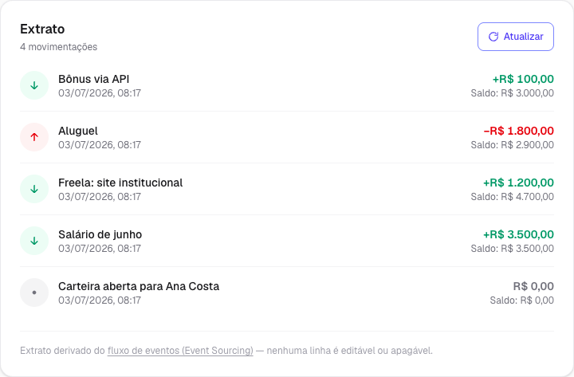
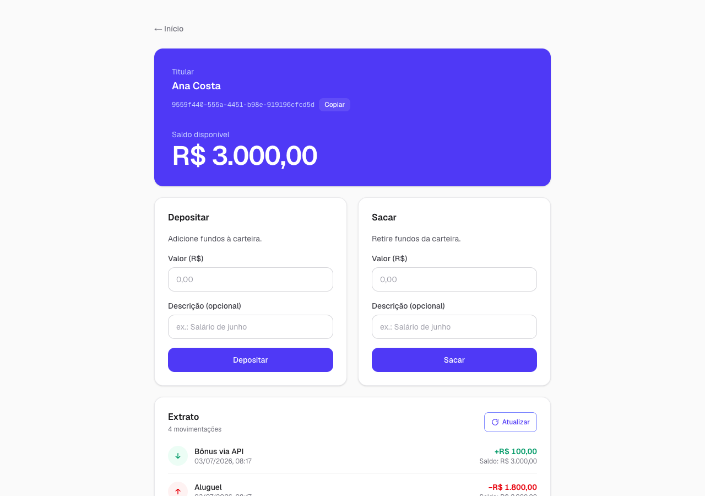
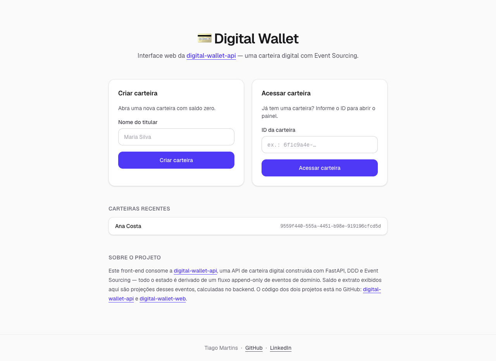

# 💳 Digital Wallet Web

Interface web em **Next.js + TypeScript + Tailwind CSS** para a [Digital Wallet API](https://github.com/DevTM71/digital-wallet-api) — uma carteira digital construída com **DDD e Event Sourcing**. O extrato exibido aqui não é uma tabela editável: é literalmente o fluxo append-only de eventos do backend, renderizado linha a linha com o saldo após cada operação.


## Screenshots

**Extrato** — o fluxo de eventos renderizado: cada linha é um evento de domínio, com saldo acumulado após cada um.



**Painel da carteira** — saldo em destaque e formulários de depósito e saque.



**Home** — criação e acesso de carteiras, com lista de recentes.



## Funcionalidades

- Criar carteira e acessar carteira existente por ID
- Carteiras recentes (últimas 5) guardadas em `localStorage`
- Depósito e saque com validação leve no cliente e feedback imediato (toast + saldo e extrato atualizados juntos, sem F5)
- Tratamento de erros de domínio: o **409 de saldo insuficiente exibe a mensagem do backend** no cartão de saque; 422 vira "Valor inválido"; API fora do ar vira aviso global com a URL esperada
- Extrato em tempo real derivado dos eventos — ordem cronológica inversa, ícone e cor por tipo, `balance_after` calculado no backend
- Acessibilidade básica: inputs com `label`, `aria-busy` em botões de loading, foco visível, `aria-live` no saldo

## Arquitetura

```
src/
├── app/                      # rotas (App Router)
│   ├── page.tsx              # home: criar/acessar carteira + recentes
│   └── wallet/[id]/page.tsx  # painel da carteira
├── components/               # componentes React reutilizáveis
│   ├── WalletDashboard.tsx   # painel: saldo, formulários e extrato
│   ├── StatementSection.tsx  # extrato: o fluxo de eventos renderizado
│   ├── TransactionForm.tsx   # formulário compartilhado de depósito/saque
│   └── …                     # Button, Card, TextField, Alert, Footer
└── lib/
    ├── api.ts                # cliente tipado da API + erros de domínio
    ├── types.ts              # tipos espelhando o contrato Pydantic
    ├── format.ts             # formatação pt-BR (moeda e data/hora)
    └── recents.ts            # carteiras recentes em localStorage
```

Algumas decisões: os tipos de `lib/types.ts` espelham 1:1 os schemas Pydantic da API, mantendo o contrato explícito dos dois lados. O cliente distingue `ApiError` (a API respondeu com erro de domínio — 404/409/422 com `detail`) de `ApiUnavailableError` (a API nem respondeu), para que a UI trate "regra de negócio violada" e "backend fora do ar" de formas diferentes. Valores monetários trafegam como **strings decimais** (decisão da API para evitar erro de ponto flutuante) e só ganham formato R$ na exibição. A lista de recentes usa `useSyncExternalStore`, o hook do React para ler uma store externa (o `localStorage`) com SSR seguro e sem mismatch de hidratação.

## Como rodar

Pré-requisito: a [digital-wallet-api](https://github.com/DevTM71/digital-wallet-api) rodando em `http://localhost:8000` — no repositório dela, basta `docker compose up`.

```bash
cp .env.local.example .env.local   # define NEXT_PUBLIC_API_URL=http://localhost:8000
npm install
npm run dev                        # abre em http://localhost:3000
```

A URL da API é lida de `NEXT_PUBLIC_API_URL`. Se o front rodar em outra origem, inclua essa origem no `CORS_ORIGINS` do backend (por padrão ele permite `http://localhost:3000`).

---

Desenvolvido por [Tiago Martins](https://github.com/DevTM71) — fluxo de trabalho acelerado por IA com Claude Code.
